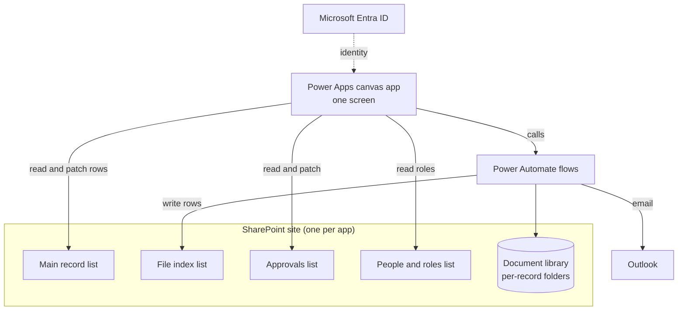

# 01: Platform map. What we build on and where the line between code and clicks sits

This doc is the orientation. Read it first. It explains the stack, why it looks the way it does, what kind of app it produces, and the single most important planning fact: which parts of a Power Platform app can be built as code and which parts are always manual clicks.

---

## The stack

Every app built with this playbook uses the same five pieces:

| Layer | Technology | Role |
|---|---|---|
| Front end | Power Apps canvas app | The entire UI. One screen, many containers. |
| Database | SharePoint Online lists | The system of record. One site per app. |
| File storage | SharePoint document library | One folder set per record, created by a flow. |
| Automation | Power Automate cloud flows | Folder creation, file uploads, email notifications. |
| Identity | Microsoft Entra ID | Who the user is. `User().Email` drives every permission check. |

Email goes out through the Office 365 Outlook connector (Send an email V2), sent as the person who clicks the button. Microsoft Approvals in Teams is an optional upgrade for executive sign off.

## Why SharePoint and not Dataverse

Dataverse is the licensed premium database. SharePoint lists are included in standard Microsoft 365 licensing. Backing the app with SharePoint keeps it free of premium per-user licensing, which is usually the difference between the app existing and not existing.

The trade offs you accept:

- No Power Platform Git Integration. That supported source control path requires the app to live in a Dataverse solution with Dataverse as the backing store. Without it, source control is the pac CLI workflow described in 03_SOURCE_WORKFLOW.md, including its one way door.
- Delegation limits. SharePoint queries in Power Fx are only partly delegable. Person column filters are non delegable. Keep hot lists small (approvals, roles) and design dashboards so the non delegable parts run over small filtered sets.
- No Business Process Flows. Multi step processes with branching are hand built with containers and a step number column. That is exactly what the patterns in this playbook do.

If a process outgrows this (thousands of records, complex relational data, offline), the grown up option is a model driven app on Dataverse. Note it, do not start there.

## What this playbook builds

Everything in these docs shipped in production. The proven shape is a governed multi step business process:

- A record (a deal, a request, a case) moves through numbered steps: intake, analysis, review, approval, record and lock.
- One app can hold several routes through those steps (a full route and lighter variants) that share one record list, one folder scheme, and shared UI panels.
- Each step has required fields or required evidence (files) before the record can move. Evidence gates count rows in a file index list, not user ticked checkboxes.
- Approvers sign off row by row, in parallel or behind sequential gates, with every decision one auditable row. Rejections send the record back and start a new numbered cycle with full history kept.
- Every record gets its own document folder with standard subfolders, created automatically, with template documents dropped in.
- Email notifications fire at hand offs, deduplicated, with deep links that land the recipient on the exact record.
- Dashboards show record status and personal workload. Finished records are locked read only.
- Who approves and who administers is data in a roles list, not hardcoded names.

Concretely, that covers apps like a deal review and approval portal, a statement of work governance pipeline, an intake and triage desk, or any process where work must pass gates, collect documents, and get signed off.

## The line between code and clicks

This is the most important planning table in the repo. Everything you build falls into one of five buckets. Plan every feature against this table before you start.

### Bucket 1: canvas app source (pa.yaml). Codeable

All of this can be written as YAML source and packed into an app, until the one way door closes (see 03_SOURCE_WORKFLOW.md):

- Screens, group containers, labels, classic buttons, classic text inputs, checkboxes, date pickers, galleries (vertical and horizontal), HTML viewers, icons, rectangles, timers.
- Every Power Fx formula: App.OnStart, OnVisible, OnSelect, Visible, DisplayMode, Items, Fill, and the rest.
- The theme record, all variables, all navigation logic, all gating logic.

### Bucket 2: canvas app, Studio only. Never codeable

These controls exist only through Power Apps Studio. `pac canvas pack` rejects them (error PA2108) and there is no format that dodges it:

- Combo boxes (people pickers). `Classic/ComboBox` needs the `SearchItems` property at runtime and pack rejects that property.
- The attachment upload stack. `Form` plus `TypedDataCard` (ClassicAttachmentsEdit) plus `Attachments`. Same rich control family.
- Adding a Power Automate flow to the app (the Power Automate pane) so `.Run()` resolves.
- Running App.OnStart inside Studio, connecting data sources on first open.

The moment one of these exists in the app, YAML packing is dead for the whole app forever. Sequence your build around that fact.

### Bucket 3: Power Automate flow definitions. Codeable after a skeleton exists

Flow logic is JSON and can be authored and edited as code, with one caveat: the trigger, connection references and auth boilerplate are error prone to hand author from nothing. The proven method is skeleton first: a human creates the trigger and connection in the designer, exports the solution, then the JSON logic is written as code. Details in 09_FLOWS.md.

### Bucket 4: maker portal clicks. Always manual

- Creating the flow skeletons and connections.
- Importing a packed .msapp or a solution zip.
- Exporting the solution or downloading the app.
- Sharing the app with users, publishing versions.
- Getting the app play URL for deep links.

### Bucket 5: SharePoint clicks. Always manual (scriptable at best)

- Creating the site, the lists, every column with its exact type and choice values.
- Creating the document library, top level folders, and a templates library.
- Setting permissions on lists and on the confidential folders.
- Seeding the people and roles list.

Columns can be scripted with PnP PowerShell if you want, but plan for by hand building against a written spec. Either way the app code cannot create its own backend. Phase order in 11_BUILD_PLAYBOOK.md is backend first for exactly this reason.

## Design principles (non negotiable)

These are the physics every pattern in this repo assumes:

1. Governance over convenience. Data integrity wins over user shortcuts.
2. Files are truth. When a step needs evidence, gate on rows in the file index list, never on a checkbox.
3. Single source of truth. Workflow state lives in SharePoint. The UI mirrors it. Never the reverse.
4. One writer per column. Every SharePoint column is written by the app or by one flow, never both. The other side only reads it.
5. Cycle awareness. Approval processes that can loop always carry a cycle number, and every approval query filters on the current cycle.
6. Audit fields are mandatory. Every change stamps who and when (`Last_Updated_On` on every patch).
7. Elevated visibility is not elevated authority. Admins see everything, they do not bypass gates.
8. Roles are data. A roles list maps role to person. No hardcoded emails anywhere.

## Where to go next

| You want to | Read |
|---|---|
| Set up the tools | 02_ENVIRONMENT_SETUP.md |
| Understand pa.yaml and the one way door | 03_SOURCE_WORKFLOW.md |
| Design the lists | 04_SHAREPOINT_DATA.md |
| Understand the app shell | 05_APP_ARCHITECTURE.md |
| Write correct Power Fx | 06_POWERFX_RULES.md |
| Build steppers, gates, panels | 07_UI_PATTERNS.md |
| Build approvals and permissions | 08_APPROVALS_PERMISSIONS.md |
| Build the flows | 09_FLOWS.md |
| Know every manual click | 10_MANUAL_STEPS.md |
| Build a whole new app start to finish | 11_BUILD_PLAYBOOK.md |
| Wire an AI assistant into the build | 12_WORKING_WITH_AI.md |
| Fix an error | 13_TROUBLESHOOTING.md |
