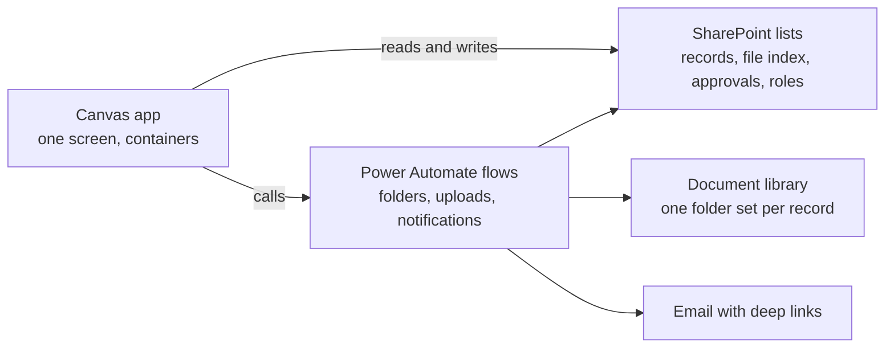

# Power Platform Playbook

Everything learned building production Power Apps the code first way, written down so anyone (or anyone's AI assistant) can do it without living through the same lessons.

This is a general guide, not documentation for any specific app. The method: single screen Power Apps canvas apps on SharePoint lists with Power Automate flows, built and version controlled as text, pa.yaml canvas source, flow JSON, and markdown design docs in git. Every pattern, rule, and error in these docs earned its place on a real production build.

The playbook ships as seven task specific agent skills following the Agent Skills standard (a `SKILL.md` with `name` and `description` frontmatter plus a `references/` folder holding the playbook docs). The same skill folders work in Claude Code, Codex, and Cursor, and each one is self contained: copy it alone and nothing breaks.

## Install

### Claude Code

This repo is a Claude Code plugin. It works anywhere you run Claude Code: the CLI, the VS Code or JetBrains extension, and the desktop app. The repo is public, so anyone can install it on any Claude plan.

Terminal, the reliable way that works in every setup:

```
claude plugin marketplace add MrezaGHS/PowerPlatform.Skills
claude plugin install powerplatform-skills@powerplatform-skills
```

Run those from a project folder, not your home directory. A git safety check can otherwise refuse to clone. Then `claude plugin list` should show `powerplatform-skills` as enabled. Restart your Claude Code session so the skills load.

Inside a Claude Code chat session, the interactive form also works:

```
/plugin marketplace add MrezaGHS/PowerPlatform.Skills
/plugin install powerplatform-skills@powerplatform-skills
```

The `/plugin` command is not available in every surface (the desktop app hides it), so use the terminal commands above if you do not see it. Update later with `claude plugin update powerplatform-skills` (or `/plugin update` in chat).

### Codex and Cursor (one shared step)

Both Codex and Cursor read skills from `~/.agents/skills/`. Clone the repo and copy the skill folders there once, and both tools pick them up.

PowerShell (Windows):

```
git clone https://github.com/MrezaGHS/PowerPlatform.Skills
Copy-Item -Recurse -Force PowerPlatform.Skills/skills/* ~/.agents/skills/
```

macOS or Linux:

```
git clone https://github.com/MrezaGHS/PowerPlatform.Skills
mkdir -p ~/.agents/skills && cp -R PowerPlatform.Skills/skills/* ~/.agents/skills/
```

To update: `git pull` in the clone, then run the copy again. Every skill folder is self contained, so copying only the skills you want also works.

For project scoped use instead of user wide, copy the skill folders into the project's `.agents/skills/` folder. Both tools discover that too.

### Native alternatives

- Codex: the `$skill-installer` skill can be prompted with this repo's URL to fetch skills.
- Cursor: Customize, Rules, Add Rule, Remote Rule (GitHub) accepts this repo's URL, and Cursor also discovers `.cursor/skills/`.

The clone and copy method above is the supported team path. Use these only if you prefer them.

## Who this is for

A developer (or a capable AI assistant with these skills installed) who needs to build an internal business process app on Microsoft 365 without premium licensing: multi step workflows, approvals, document folders, notifications, dashboards, audit locks. If you can read a formula and use a terminal, this is enough to build all of that.

## The skills

Each skill triggers on its own slice of the work and carries its playbook docs in its `references/` folder.

| Skill | What it does | Example trigger |
|---|---|---|
| [`powerapps-build-playbook`](skills/powerapps-build-playbook/SKILL.md) | Plan and run a whole new app end to end, the code versus clicks map, manual step specs, working with an AI assistant. | "build a new power app", "what do I click" |
| [`powerapps-source-workflow`](skills/powerapps-source-workflow/SKILL.md) | pa.yaml, pack and unpack, the one way door (PA2108), pac auth, repo layout. | "unpack the msapp", "pack fails" |
| [`powerapps-sharepoint-data`](skills/powerapps-sharepoint-data/SKILL.md) | List design, the four list shape, column types, naming, the schema contract. | "design my SharePoint lists" |
| [`powerapps-architecture-and-ui`](skills/powerapps-architecture-and-ui/SKILL.md) | The single screen shell, OnStart and OnVisible, naming, steppers, gates, panels, dashboards. | "add a panel", "build a stepper" |
| [`powerapps-powerfx`](skills/powerapps-powerfx/SKILL.md) | Every Power Fx formula, the 22 non negotiable rules as wrong versus right code. | "my Power Fx has an error" |
| [`powerapps-approvals-and-flows`](skills/powerapps-approvals-and-flows/SKILL.md) | The approval engine, cycles and returns, the two layer access model, flow JSON and the four proven flow shapes. | "add an approval", "write the flow" |
| [`powerapps-troubleshooting`](skills/powerapps-troubleshooting/SKILL.md) | Error to cause to fix, everything that actually broke. | any pasted error message |

## The playbook docs

The original numbered docs live on inside the skills. Reading order for a human first pass: 01, then 03, then 11. Those three give you the platform, the core constraint, and the method. The rest are reference docs you pull up while building. To wire an AI assistant into a build, read 12 first.

| Doc | Lives in | What it holds |
|---|---|---|
| [01_PLATFORM_MAP.md](skills/powerapps-build-playbook/references/01_PLATFORM_MAP.md) | `powerapps-build-playbook` | The stack, why SharePoint and not Dataverse, what this builds, and the five bucket map of what is code versus what is clicks |
| [02_ENVIRONMENT_SETUP.md](skills/powerapps-source-workflow/references/02_ENVIRONMENT_SETUP.md) | `powerapps-source-workflow` | Tools, pac auth, repo layout, gitignore, the pull request workflow, git discipline |
| [03_SOURCE_WORKFLOW.md](skills/powerapps-source-workflow/references/03_SOURCE_WORKFLOW.md) | `powerapps-source-workflow` | pa.yaml anatomy, pack and unpack, the one way door (PA2108), the two eras of the workflow |
| [04_SHAREPOINT_DATA.md](skills/powerapps-sharepoint-data/references/04_SHAREPOINT_DATA.md) | `powerapps-sharepoint-data` | The four list shape, naming rules, column types in Power Fx, files are truth, the schema contract doc |
| [05_APP_ARCHITECTURE.md](skills/powerapps-architecture-and-ui/references/05_APP_ARCHITECTURE.md) | `powerapps-architecture-and-ui` | The single screen shell: view state, OnStart sections, OnVisible sync, theme, naming conventions |
| [06_POWERFX_RULES.md](skills/powerapps-powerfx/references/06_POWERFX_RULES.md) | `powerapps-powerfx` | 22 non negotiable rules and gotchas, each as wrong versus right code |
| [07_UI_PATTERNS.md](skills/powerapps-architecture-and-ui/references/07_UI_PATTERNS.md) | `powerapps-architecture-and-ui` | Clickable stepper, gates, shared panels, concurrency safe moves, debounce and auto grey, dashboards |
| [08_APPROVALS_PERMISSIONS.md](skills/powerapps-approvals-and-flows/references/08_APPROVALS_PERMISSIONS.md) | `powerapps-approvals-and-flows` | The approval engine (rows, cycles, returns) and the two layer access model |
| [09_FLOWS.md](skills/powerapps-approvals-and-flows/references/09_FLOWS.md) | `powerapps-approvals-and-flows` | Flow JSON anatomy, the four proven flow shapes, the skeleton first method, solution registration |
| [10_MANUAL_STEPS.md](skills/powerapps-build-playbook/references/10_MANUAL_STEPS.md) | `powerapps-build-playbook` | Every click that can never be code, the STUDIO_TODO artifact, the paste driven change loop |
| [11_BUILD_PLAYBOOK.md](skills/powerapps-build-playbook/references/11_BUILD_PLAYBOOK.md) | `powerapps-build-playbook` | The end to end method for a new app: mockup, backend first, container loop, door sequencing, flows last |
| [12_WORKING_WITH_AI.md](skills/powerapps-build-playbook/references/12_WORKING_WITH_AI.md) | `powerapps-build-playbook` | Connecting an AI assistant, the custom instructions template, the division of labor, redaction |
| [13_TROUBLESHOOTING.md](skills/powerapps-troubleshooting/references/13_TROUBLESHOOTING.md) | `powerapps-troubleshooting` | Error to cause to fix, everything that actually broke |

## The shape of what you can build



A record moves through numbered steps with required fields and required evidence, approvers sign off row by row with full cycle history, every record gets its own folder, and finished records lock read only. All of it on standard Microsoft 365 licensing.

## Honesty notes

- The canvas source workflow (`pac canvas pack` and `unpack`) is a deprecated preview feature and it is a one way door. Doc 03 explains exactly where it breaks and how to work after it does. This playbook works with that reality instead of pretending it is not there.
- The examples use a fictional deal review app (`Deals`, `Approvals`, `Role_Config`, `varDeal`) so every formula reads concretely. Swap the nouns for your process.
- Everything here earned its place on a real build. When you learn something new the hard way, add it. When something here goes stale, fix it. The playbook is only worth what it reflects.
