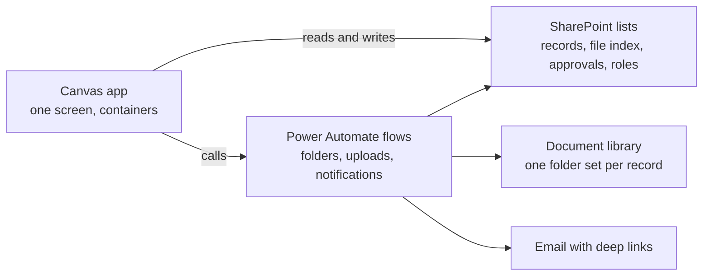

# Power Platform Playbook

Everything learned building production Power Apps the code first way, written down so anyone (or anyone's AI assistant) can do it without living through the same lessons.

This is a general guide, not documentation for any specific app. The method: single screen Power Apps canvas apps on SharePoint lists with Power Automate flows, built and version controlled as text, pa.yaml canvas source, flow JSON, and markdown design docs in git. Every pattern, rule, and error in these docs earned its place on a real production build.

## Who this is for

A developer (or a capable AI assistant with these files in context) who needs to build an internal business process app on Microsoft 365 without premium licensing: multi step workflows, approvals, document folders, notifications, dashboards, audit locks. If you can read a formula and use a terminal, this is enough to build all of that.

## How to use it

Reading order for a first pass: 01, then 03, then 11. Those three give you the platform, the core constraint, and the method. The rest are reference docs you pull up while building.

If you are wiring an AI assistant into the build (the recommended way), read 12 first, it tells you how to connect these docs and how to run the collaboration. [SKILL.md](skills/powerplatform-skill/SKILL.md) is the operating contract for the assistant. Install it as a Claude Code plugin (see Install below), or just point a coding agent at the repo (CLAUDE.md routes it there automatically).

## Install

In Claude Code, add this repo as a plugin marketplace and install the plugin:

```
/plugin marketplace add MrezaGHS/PowerPlatform.Skills
/plugin install powerplatform-skills@powerplatform-skills
```

That installs the build skill. It auto triggers on Power Apps and Power Automate work, and it reads the numbered docs below straight from the plugin. Works on any Claude plan, the repo is public.

## The docs

| Doc | What it holds |
|---|---|
| [01_PLATFORM_MAP.md](01_PLATFORM_MAP.md) | The stack, why SharePoint and not Dataverse, what this builds, and the five bucket map of what is code versus what is clicks |
| [02_ENVIRONMENT_SETUP.md](02_ENVIRONMENT_SETUP.md) | Tools, pac auth, repo layout, gitignore, the pull request workflow, git discipline |
| [03_SOURCE_WORKFLOW.md](03_SOURCE_WORKFLOW.md) | pa.yaml anatomy, pack and unpack, the one way door (PA2108), the two eras of the workflow |
| [04_SHAREPOINT_DATA.md](04_SHAREPOINT_DATA.md) | The four list shape, naming rules, column types in Power Fx, files are truth, the schema contract doc |
| [05_APP_ARCHITECTURE.md](05_APP_ARCHITECTURE.md) | The single screen shell: view state, OnStart sections, OnVisible sync, theme, naming conventions |
| [06_POWERFX_RULES.md](06_POWERFX_RULES.md) | 22 non negotiable rules and gotchas, each as wrong versus right code |
| [07_UI_PATTERNS.md](07_UI_PATTERNS.md) | Clickable stepper, gates, shared panels, concurrency safe moves, debounce and auto grey, dashboards |
| [08_APPROVALS_PERMISSIONS.md](08_APPROVALS_PERMISSIONS.md) | The approval engine (rows, cycles, returns) and the two layer access model |
| [09_FLOWS.md](09_FLOWS.md) | Flow JSON anatomy, the four proven flow shapes, the skeleton first method, solution registration |
| [10_MANUAL_STEPS.md](10_MANUAL_STEPS.md) | Every click that can never be code, the STUDIO_TODO artifact, the paste driven change loop |
| [11_BUILD_PLAYBOOK.md](11_BUILD_PLAYBOOK.md) | The end to end method for a new app: mockup, backend first, container loop, door sequencing, flows last |
| [12_WORKING_WITH_AI.md](12_WORKING_WITH_AI.md) | Connecting an AI assistant, the custom instructions template, the division of labor, redaction |
| [13_TROUBLESHOOTING.md](13_TROUBLESHOOTING.md) | Error to cause to fix, everything that actually broke |

## The shape of what you can build



A record moves through numbered steps with required fields and required evidence, approvers sign off row by row with full cycle history, every record gets its own folder, and finished records lock read only. All of it on standard Microsoft 365 licensing.

## Honesty notes

- The canvas source workflow (`pac canvas pack` and `unpack`) is a deprecated preview feature and it is a one way door. Doc 03 explains exactly where it breaks and how to work after it does. This playbook works with that reality instead of pretending it is not there.
- The examples use a fictional deal review app (`Deals`, `Approvals`, `Role_Config`, `varDeal`) so every formula reads concretely. Swap the nouns for your process.
- Everything here earned its place on a real build. When you learn something new the hard way, add it. When something here goes stale, fix it. The playbook is only worth what it reflects.
